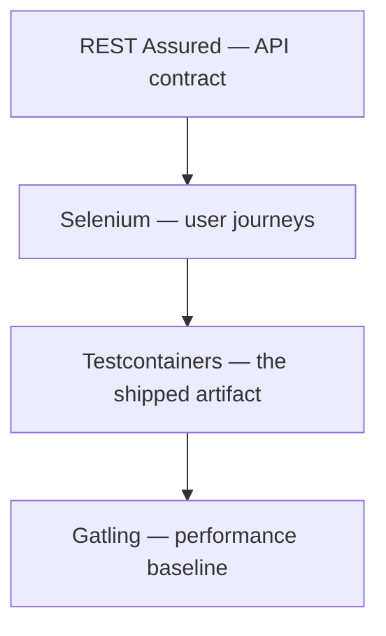

# checkride


QA automation framework for [aerolane](https://github.com/rajanshxrma/aerolane). The app repo tests its own code; checkride tests the running system from the outside, the way a QA team would — API contracts, browser flows, the deployed Docker stack, and load. A checkride is the exam a pilot has to pass before flying; same idea.

REST Assured · Selenium (Page Object Model) · JUnit 5 tagged suites · Testcontainers · Gatling · Allure · GitHub Actions

## The suites

| Suite | What it proves | Command | Needs |
|---|---|---|---|
| Smoke | app is up, auth contract holds | `mvn -Psmoke test` | running app |
| API | REST contract: shapes, status codes, validation, RBAC | `mvn -Papi test` | running app |
| UI | login, role-based visibility, inspection flow in real Chrome | `mvn -Pui test` | running app + Chrome |
| Regression | full tagged regression across API + UI | `mvn -Pregression test` | running app + Chrome |
| Integration | builds the app image from source, boots app+Postgres, tests the artifact | `mvn -Pintegration test` | Docker + sibling `../aerolane` |
| Performance | baseline load with hard p95/error-rate assertions | `mvn gatling:test` | running app |

A bare `mvn test` deliberately runs nothing that needs a live app, so the repo always builds clean.

## Run it

```bash
git clone https://github.com/rajanshxrma/aerolane && (cd aerolane && docker compose up -d --build)
git clone https://github.com/rajanshxrma/checkride && cd checkride
mvn -Papi test
```

Point the suites anywhere with `BASE_URL` (defaults to `http://localhost:8090`, aerolane's default host port). Credentials override via `OFFICER_USER`/`OFFICER_PASSWORD` etc. — see `support/Config.java`.

## What's being tested and why



The interesting assertions are the negative ones. Anyone can test the happy path; these suites pin down the failure semantics:

- **401 vs 403 are different bugs.** No credentials → 401. Wrong password → 401. Right password, wrong role → 403. `AuthContractTest` fails if the app ever blurs them.
- **Hiding the button isn't security.** `RbacUiTest` checks the auditor can't *see* "Log inspection" — then types the URL directly and asserts the server says 403 anyway.
- **Bad input is a 400, never a 500.** Unknown enum values, missing fields, oversized notes, garbage filter params — all must come back as structured validation errors.
- **Suites clean up after themselves.** The lane-status test reads the current state, flips it, asserts, and restores it, so order doesn't matter and reruns are safe.
- **"It got slow" is a red build.** Gatling asserts p95 < 800ms and error rate < 1% — a number, not a vibe.

## Reports

Allure results collect in `target/allure-results` on every run:

```bash
mvn -Papi test
mvn io.qameta.allure:allure-maven:2.12.0:serve   # opens the report in a browser
```

Gatling writes its HTML report to `target/gatling` after `mvn gatling:test`.

## CI

Every push: GitHub Actions checks out **both** repos, boots the real stack with compose, waits for health, then runs the API and UI suites against it (Chrome headless on the runner). Test output and Allure results upload as artifacts on every run, pass or fail.

## Process docs

The written half of QA lives in [`docs/`](docs/): the [test plan](docs/TESTPLAN.md) (scope, pyramid, environments, entry/exit criteria, severity matrix), a [UAT checklist](docs/uat-checklist.md) for manual acceptance passes per role, and the [defect report template](docs/defect-report-template.md).

## Layout

```
src/test/java/com/checkride/
  support/       Config — env-driven, same tests run local and CI
  api/           REST Assured suites + base spec builders
  ui/            Selenium suites
  ui/pages/      Page objects (no By selectors inside tests)
  integration/   Testcontainers full-stack suite
  perf/          Gatling simulations
docker/          compose file for the integration suite
docs/            test plan, UAT checklist, defect template
```
