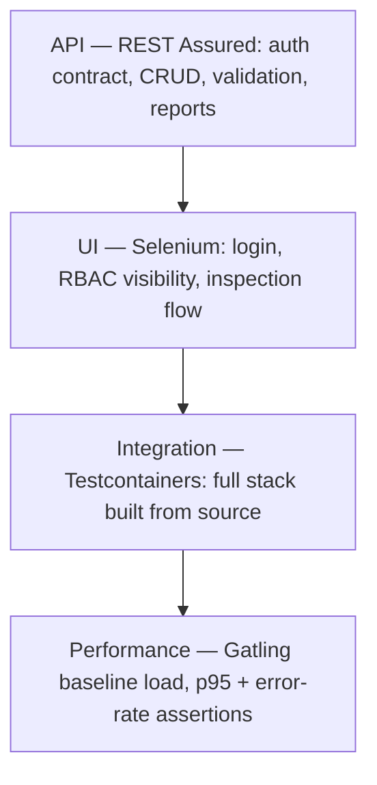

# checkride test plan

System under test: [aerolane](https://github.com/rajanshxrma/aerolane) — screening-lane and equipment-inspection tracker (Spring Boot 3, PostgreSQL, RBAC with three roles).

## What we're trying to prove

1. The security model holds: 401 vs 403 vs redirect semantics are correct, and role boundaries are enforced server-side, not just hidden in the UI.
2. The API contract is stable: shapes, status codes, validation behavior, error payloads.
3. The core user journeys work in a real browser: sign in, log an inspection, see it reflected.
4. The shipped artifact works: the Docker image built from source boots against real Postgres, migrates, seeds, and behaves.
5. Performance doesn't silently rot: baseline load has hard pass/fail thresholds.

## Test pyramid

Unit tests live in the app repo next to the code they test (service logic, security config, API slices). checkride starts where the app's own tests stop: everything here is black-box against a running instance.

## Suites and when they run

| Suite | Tag | Command | Needs | When |
|---|---|---|---|---|
| Smoke | `smoke` | `mvn -Psmoke test` | running app (+ Chrome for 2 tests) | every deploy, < 1 min |
| API | `api` | `mvn -Papi test` | running app | every push (CI) |
| UI | `ui` | `mvn -Pui test` | running app + Chrome | every push (CI) |
| Regression | `regression` | `mvn -Pregression test` | running app + Chrome | before release |
| Integration | `integration` | `mvn -Pintegration test` | Docker + sibling aerolane checkout | nightly / before release |
| Performance | — | `mvn gatling:test` | running app | before release, after perf-sensitive changes |

## Environments

| Env | Base URL | How |
|---|---|---|
| Local | `http://localhost:8080` (default) | `docker compose up --build` in the app repo |
| CI | `http://localhost:8080` on the runner | compose brought up in the workflow |
| Any other | set `BASE_URL` env var | suites are environment-agnostic by design |

Credentials come from env vars with seeded-demo defaults (see `support/Config.java`).

## Entry / exit criteria

Entry: app boots, `/actuator/health` is UP, seed data present.

Exit (release): API + UI + regression green, integration green, Gatling assertions passing, zero open Sev-1/Sev-2 defects, Sev-3+ triaged with owner.

## Defect severity

| Sev | Meaning | Example | Response |
|---|---|---|---|
| 1 | Security boundary broken or data loss | auditor can POST inspections | stop ship, fix now |
| 2 | Core journey broken, no workaround | officer can't log an inspection | fix before release |
| 3 | Feature broken, workaround exists | filter chips wrong, direct URL works | next sprint |
| 4 | Cosmetic / minor | badge color off | backlog |

Defects get filed with [the template](defect-report-template.md); manual acceptance passes use [the UAT checklist](uat-checklist.md).

## Out of scope (deliberately)

Load beyond baseline profile, penetration testing beyond RBAC boundaries, accessibility audit automation (manual checklist covers basics), cross-browser matrix (Chrome only — the app is an internal ops tool).
